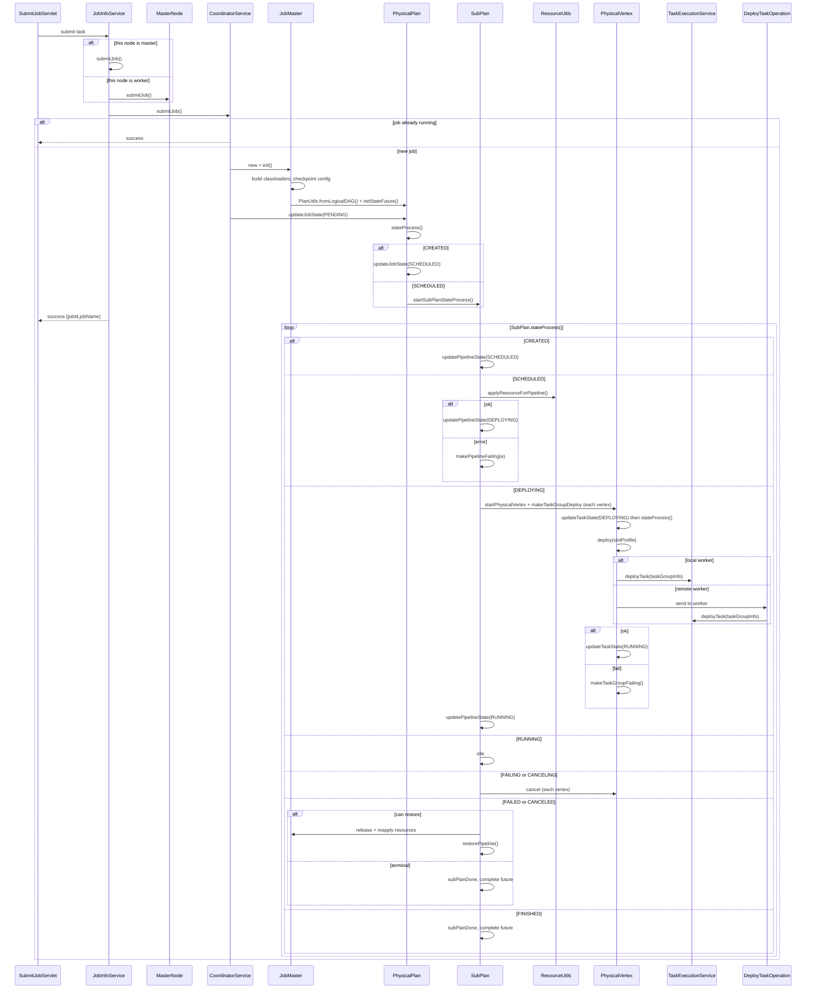

# Seatunnel 调用submitJob提交任务后,处理逻辑流程时序图

### 本图主要梳理了提交任务d到TaskExecutionService并部署任务，不涉及TaskExecutionService里面线程模型和数据流

```mermaid
sequenceDiagram
    participant Servlet as SubmitJobServlet
    participant JobInfo as JobInfoService
    participant Master as MasterNode
    participant Coord as CoordinatorService
    participant JM as JobMaster
    participant Plan as PhysicalPlan
    participant Sub as SubPlan
    participant RU as ResourceUtils
    participant Vtx as PhysicalVertex
    participant TES as TaskExecutionService
    participant DTO as DeployTaskOperation
    Servlet->>JobInfo: submit task
    alt this node is master
        JobInfo->>JobInfo: submitJob()
    else this node is worker
        JobInfo->>Master: submitJob()
    end
    JobInfo->>Coord: submitJob()
    alt job already running
        Coord-->>Servlet: success
    else new job
        Coord->>JM: new + init()
        JM->>JM: build classloaders, checkpoint config
        JM->>Plan: PlanUtils.fromLogicalDAG() + initStateFuture()
        Coord->>Plan: updateJobState(PENDING)
        Plan->>Plan: stateProcess()
        alt CREATED
            Plan->>Plan: updateJobState(SCHEDULED)
        else SCHEDULED
            Plan->>Sub: startSubPlanStateProcess()
        end
        JobInfo-->>Servlet: success {jobId,jobName}
        loop SubPlan.stateProcess()
            alt CREATED
                Sub->>Sub: updatePipelineState(SCHEDULED)
            else SCHEDULED
                Sub->>RU: applyResourceForPipeline()
                alt ok
                    Sub->>Sub: updatePipelineState(DEPLOYING)
                else error
                    Sub->>Sub: makePipelineFailing(e)
                end
            else DEPLOYING
                Sub->>Vtx: startPhysicalVertex + makeTaskGroupDeploy (each vertex)
                Vtx->>Vtx: updateTaskState(DEPLOYING) then stateProcess()
                Vtx->>Vtx: deploy(slotProfile)
                alt local worker
                    Vtx->>TES: deployTask(taskGroupInfo)
                else remote worker
                    Vtx->>DTO: send to worker
                    DTO->>TES: deployTask(taskGroupInfo)
                end
                alt ok
                    Vtx->>Vtx: updateTaskState(RUNNING)
                else fail
                    Vtx->>Vtx: makeTaskGroupFailing()
                end
                Sub->>Sub: updatePipelineState(RUNNING)
            else RUNNING
                Sub->>Sub: idle
            else FAILING or CANCELING
                Sub->>Vtx: cancel (each vertex)
            else FAILED or CANCELED
                alt can restore
                    Sub->>JM: release + reapply resources
                    Sub->>Sub: restorePipeline()
                else terminal
                    Sub->>Sub: subPlanDone, complete future
                end
            else FINISHED
                Sub->>Sub: subPlanDone, complete future
            end
        end
    end
```
